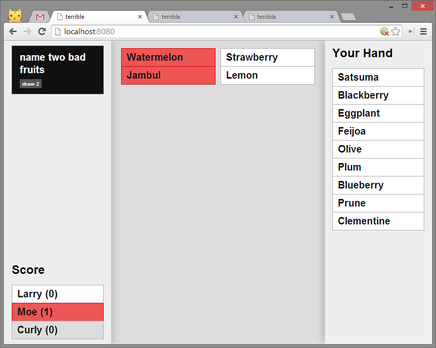

# terrible

A *Cards Against Humanity* style-game for a single room of users. Extremely WIP if not hacky.

## Requirements

Runs on Node.js.

`npm install express`

`npm install socket.io`

## Setup

Create a `shared/prompts.json` (these are the black cards in *CAH*) and `shared/responses.json` (likewise, the white cards) based off the example files. These can be *CAH* or *Apples to Apples* style, or anything else that follows a **prompt : response(s)** format.

Once that's done, run `node server.js` and open `localhost:8080` in your web browser. Three or more players are required for a game.

## Known Issues

  * lots, probably
  * users newly joining won't receive a full game state until the next round